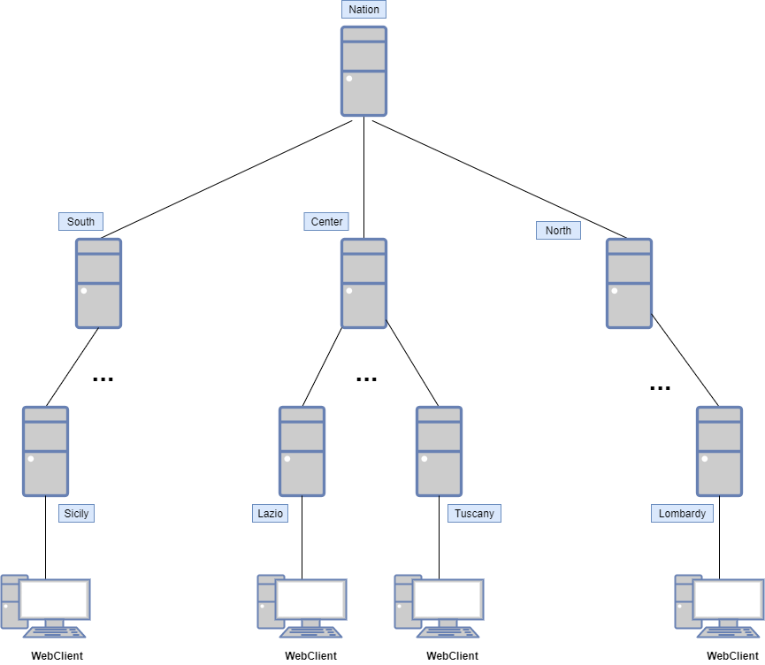

# CovidTracker

## Introduction
The project aims to establish a **distributed system with a hierarchical organization** that tracks data related to the Covid-19 pandemic such as the number of positive, negative, and inconclusive test results, and fatalities, from multiple hospitals. The network then processes this data to generate statistical aggregations.

To cover the Italian territory we provide a three layers hierarchy composed by:
1. A national node.
2. Three area nodes (north, center and south).
3. Twenty region nodes, one for each region.

Here there is an overview of the Architecture of the whole system:

  

Please, check the [Documentation](Documentation.pdf) for a complete view. 

## Implementation
The application is hosted on a **Glassfish server** (version 5.1)

### Communication
For the Communication Layer we decided to implement a <b>Message Driven Communication</b> exploiting **JMS** with asynchronous send and synchronous receive.

### Erlang Server
We made use of an **Erlang Server** to provide the “on-node services” needed to elaborate the statistical aggregations required by other nodes.
Each node interacts with its specific Erlang Server.

Moreover we provide the possibility to register a different Erlang node for every possible operation, in case there is the need to distribute the load among more than just one server.

### Synchronization/Coordination
The Nation node at the end of every day sends a <i>registry closure request</i> to all the nodes.

The synchronization between nodes is guaranteed thanks to the use of **EJBs**, that are hosted inside the EJB Container of glassfish that guarantees a correct synchronization between threads that access to the same resources.

### Distributed database
For the Database, we decided to have it distributed through the whole hierarchy. Every node has its own **Key-Value database (LevelDB)** in which it stores the daily report and the result of the aggregations (in order to respond to a request for aggregation received several times by communicating with Erlang only once).
